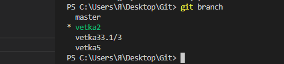

# Работа с Git

## 1. Наличие установленного Git
в терменале выполнить  `git version`

Если Git установлен, появится сообщение с версией программы. Иначе будет сообщение об ошибке.

---
## 2. Установка Git
Загружаем последнюю версию Git с сайта https://git-scm.com/downloads
Устанавливаем настройки по умолчанию

---
## 3. Первое знакомство

Все команды Git происходят в терминале. Его можно вызвать клавишами Ctrl + `

Каждая новая команда начинается с git. 

При первом использовании Git необходимо представиться
Для этого нужно ввести в терменале две команды:
```
git config --global user.name «Ваше имя английскими буквами»
git config --global user.email "ваша почта@example.com"
```
В примере выше "config" будет являться командой, а "--global" будет уже флагом команды. Он вносит изменения в работу команды. 

---
## 4. Основные команды Git
### 4.1 git init – инициализация локального репозитория
Репозиторий - папка в которой Git будет отслеживать все хранящиеся в ней файлы 

Выбрать папку можно через клавиши последовательное нажатие сочетаний клавиш ctrl + K + O

### 4.2 git status – получить информацию от git о его текущем состоянии
Используемый для определения, какие файлы в каком состоянии находятся

### 4.3 git add – добавить файл или файлы к следующему коммиту
Git начнет отслеживать выбранный файл "git add имя файла"
Не обязательно вводить имя файла целиком, достаточно ввести первые пару символов названия и далее клавишей **Tab** имя само допишется.
Если несколько файлов начинаются одинаковы, то можно перелистывать имена той же клавишей **Tab**

### 4.4 git commit – создание сохранения в репозиторий.
Сохранит изменения файла с добавлением хеш-кода
Это позволит вернуть более раннюю версию файла
Так же следует указывать понятное описание изменений по сравнению с предыдущим коммитом
Если файл уже отслеживается, то можно объединить команды **add** и **commit**
```
git commit -am 'описание коммита'
```
Буковка "а" во флаге commit как раз и содержит в себе команду add
### 4.5 git log – вывод на экран истории всех коммитов с их хеш-кодами
Показывает все изменения файла

Для большей наглядности и визуализации истории коммитов можно добавить флаг --graph 

```
git log --graph
```

### 4.6 git checkout – переход от одного коммита к другому
С его помощью можно передвигаться между версиями
не обязательно вводить весь хеш-код, достаточно первых четырех символов

### 4.7 git checkout master – вернуться к актуальному состоянию и продолжить работу
загрузить последнюю версию файла

### 4.8 git diff – увидеть разницу между текущим файлом и закоммиченным файлом
так же покажет внесенные изменения сохраненные последним коммитом
___
## 5 Синтаксис языка Markdown
### 5.1 Заголовок "#"
Заголовок – выделение заголовков. Количество символов “#” задаёт уровень.заголовка (поддерживается 6 уровней). 
Начиная со ## подзаголовки не отделяется подчеркиванием автоматически
  
# H1
## H2
### H3
#### H4
##### H5
###### H6  


### 5.2 Подчеркивание = или _  
эти символы подчеркивания (не менее 3 подряд) выделяют заголовки
первого (“=”) и второго (“-”) уровней.

"___" создает жирную линию и может находиться в любой части текста
___

"===" создает линию тоньше и располагается рядом с текстом который хотите отделить. а также определяет текст над ней как заголовок
===
### 5.3 __Полужирное начертание__
текст по краям которого находятся по два символа ** или __ будет иметь **полужирный вид**

В примере ниже используется символ + для наглядности записи

++любой записанный вами текст++

### 5.4 *Курсивное начертание* 
работает так же как и в предыдущем разделе и использует те же символы * и _

отличие лишь в одном, что по краям текста указываются по одному символу

+любой записанный вами текст+

### 5.5 ***Полужирное курсивное начертание***

все тоже самое только по три символа с краю

+++любой записанный вами текст+++

### 5.6 ~~Зачёркнутый текст~~
имеет тот же принцип что и в разделе 5.3, но с использование двойного символа ~~

### 5.7 Выделение текста цветом
имеет тот же `принцип раздела 5.4`, но с символом ` на краях

### 5.8 Не нумерованные строки и подстроки
для ненумерованных строк и используют символы - + * в любом порядке и последовательности. 
+ Строка1
- Строка2
* Строка3
  
для создания подстрок используются те же символы, но с отступами в четыре пробела или Tab

* строка1
  + подстрока1
  + подстрока2
    - подподстрока1 

точки подстрок создаются автоматически и и не влияют на выбор символа

### 5.9 Пронумерованные строки и подстроки
для нумерации используют число с точкой "1." все последующие номера строк будут создаваться автоматически и последовательно. Даже если вы решите и вручную введете после номера 4. номер 7., в итоговом варианте все равно отобразиться 5.

1. Строка1
1. строка2
1. строка3
5. строка4

однако, если вы измените первый номер списка с 1. на 7.

7. Строка1
1. строка2
1. строка3
5. строка4

нумерация всего списка измениться и будет начинаться уже с 7. даже если остальные номера останутся прежними

подстроки работают точно так же как и ненумерованные.
стоит отметить что нумерация подстрок начинается всегда 1. 

7. Строка1
   1. подстрока1
   2. подстрока2
2. строка2
   1. подстрока3
      1. подподстрока1
      2. подподстрока2
      3. 
3. строка3
4. строка4

любые изменения приведут к нарушению порядка списка

7. Строка1
   1. подстрока1
   2. подстрока2
2. строка2
   1. подстрока3
      3. подподстрока1
      5. подподстрока2
      3. подподстрока3
3. строка3
4. строка4

## 6 Игнорирование файлов
Для того, чтобы исключить из отслеживания в репозитории отслеживаемые файлы или папки необходимо создать файл "имя файла".gitignore и записать в него их названия или шаблоны, соответствующие таким файлам и папкам

```
*.png
*.jpg
*.bmp
```

## 7 Создание и удаление веток в Git
Создать ветку можно командой:
```
git branch имя новой ветки
```
В результате создается новый указатель на текущий коммит.

Ветка в Git - это простой перемещаемый указатель на один из коммитов, обычно последний в цепочке коммитов.
По умолчанию имя основной ветки Git - `master`.

Список веток в репозитории можно посмотреть с помощью команды
```
get branch
```
Текущая ветка будет - отмечена звездочкой: `*master`



Удаление происходит путем добавления флагов -d и -D, а также необходимо находиться в любой другой ветке. 

При использовании -d флага, Git не даст этого сделать если изменения в ветке не были закоммичены.

Флаг -D удалит ветку принудительно.

## 8 Переход между ветками
Переход осуществляется знакомой командой **git checkout**

Однако, вместо хеш-кода коммита мы пишем имя ветки

Если необходимо создать и сразу перейти в созданную ветку то можно воспользоваться командой 
```
git checkout -b имя ветки
```

## 9 Слияние веток и разрешение конфликтов
Для слияния выбранной ветки с текущей нужно выполнить команду 
```
git merge имя ветки которую хотим добавить в текущую
```

Если была изменена одна и та же строка файла, то может возникнуть конфликт и потребуется участие пользователя. VSCode предложить варианты решения


git log --graph так же будет визуализировать все перепутья и слияния веток